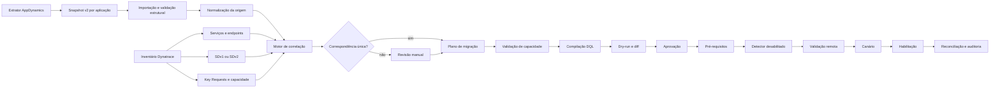
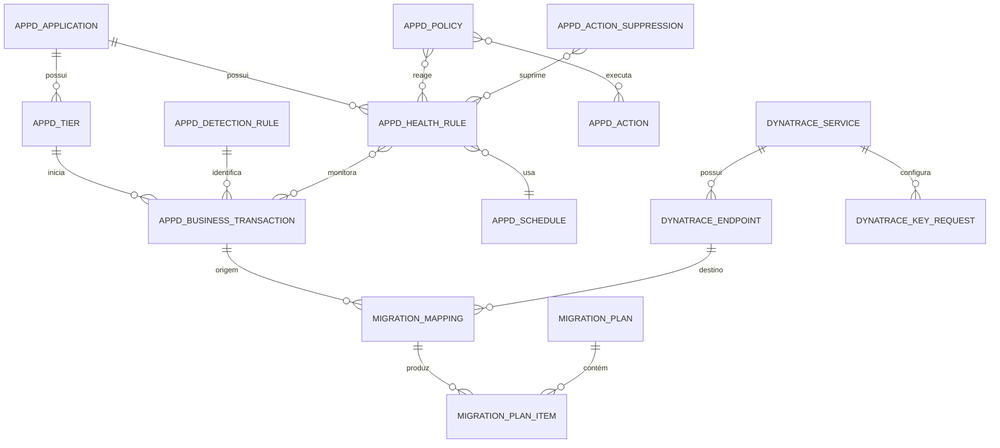
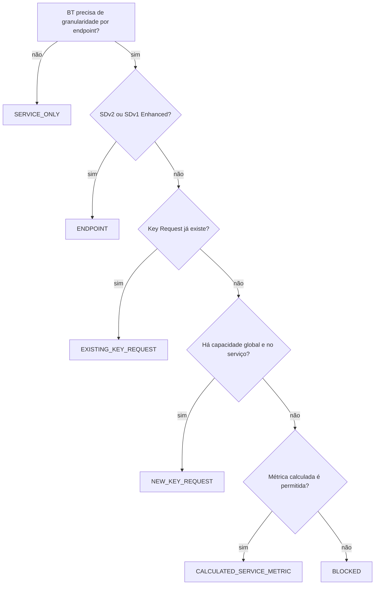
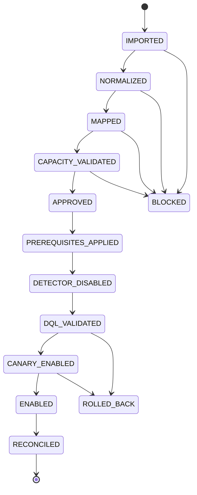

# Fluxo de correlação e criação AppDynamics → Dynatrace

**Status:** especificação pronta para implementação  
**Versão:** 0.1  
**Última revisão:** 2026-09-04

Este documento é o ponto de partida para uma nova janela de codificação. Ele
define o contrato de extração do AppDynamics, o inventário do Dynatrace, a
correlação de Business Transactions com serviços e endpoints, o controle de
capacidade de Key Requests e a publicação faseada dos alertas.

O documento não representa funcionalidade já implementada. O projeto atual
importa o contrato v1 e já sincroniza perfis, detectores, Davis Events e
problemas do Dynatrace. As estruturas v2 descritas aqui devem ser adicionadas
sem remover a compatibilidade com o v1.

## 1. Decisões obrigatórias

1. O extrator do AppDynamics entrega fatos da origem. Ele não gera DQL e não
   escolhe objetos Dynatrace.
2. O A2D transforma o snapshot de origem em um plano de migração separado.
3. Cada JSON continua representando exatamente uma Business Application.
4. O contrato v2 é aditivo. O adaptador v1 continua funcionando.
5. Todos os detectores gerados pelo A2D começam com `timeseries`.
6. Nenhum recurso remoto é criado durante importação, inventário ou correlação.
7. Toda publicação começa desabilitada, é validada e exige aprovação.
8. Key Request é uma estratégia de compatibilidade para SDv1 sem Enhanced
   Endpoints, não é o modelo principal.
9. Horário de avaliação, horário de entrega e supressão são conceitos distintos.
10. Tokens, senhas e cabeçalhos sensíveis não entram no JSON, SQLite, logs ou
    pacotes exportados.

## 2. Mapeamento conceitual

| AppDynamics | Dynatrace | Observação |
|---|---|---|
| Business Application | agrupamento, tags e ownership | não é necessariamente uma entidade monitorada |
| Tier | um ou mais serviços candidatos | relação pode ser muitos-para-muitos |
| Business Transaction | endpoint do serviço de entrada | Key Request somente quando necessário |
| Health Rule | Davis Anomaly Detector | sempre compilado para DQL `timeseries` |
| Critical/Warning Criteria | condição, modelo e evento | pode exigir mais de um artefato de destino |
| Health Rule Schedule | janela de avaliação | não confundir com baseline sazonal |
| Policy e Action | Workflow ou notificação | roteamento é posterior à detecção |
| Action Suppression | manutenção ou supressão de entrega | a regra pode continuar sendo avaliada |

Uma Business Transaction do AppDynamics representa um caminho iniciado em um
entry point e pode atravessar vários Tiers. No Dynatrace, o alvo primário será
normalmente o par `SERVICE + endpoint.name`. Serviços atravessados ficam como
contexto e não recebem automaticamente uma cópia do alerta.

## 3. Fluxo completo



## 4. Relacionamentos de domínio



## 5. Contrato de entrega do extrator

Nome proposto do schema:

```text
schemas/appdynamics-snapshot-v2.schema.json
```

Identificador:

```text
https://a2d.local/schemas/appdynamics-snapshot-v2.schema.json
```

### 5.1 Estrutura raiz

```json
{
  "$schema": "https://a2d.local/schemas/appdynamics-snapshot-v2.schema.json",
  "schemaVersion": "2.0.0",
  "snapshot": {},
  "application": {},
  "tiers": [],
  "businessTransactions": [],
  "transactionDetectionRules": [],
  "healthRules": [],
  "schedules": [],
  "policies": [],
  "actions": [],
  "actionSuppressions": [],
  "correlationEvidence": [],
  "sourceArtifacts": []
}
```

### 5.2 Metadados do snapshot

```json
{
  "snapshotId": "01J72J3F2Y5VNKZ5PVXG6R6N4N",
  "sourceSystem": "APPDYNAMICS",
  "controllerAlias": "APPD-PRD",
  "controllerVersion": "25.5",
  "accountName": "conta-a",
  "extractedAt": "2026-09-04T14:30:00-03:00",
  "encoding": "UTF-8",
  "complete": true,
  "sections": {
    "tiers": "COMPLETE",
    "businessTransactions": "COMPLETE",
    "healthRules": "COMPLETE",
    "schedules": "COMPLETE",
    "policies": "COMPLETE"
  },
  "warnings": []
}
```

Regras:

- `snapshotId` é único e imutável.
- `extractedAt` usa ISO 8601 com offset.
- cada seção usa `COMPLETE`, `PARTIAL`, `UNAVAILABLE` ou `FAILED`;
- `complete` somente pode ser `true` quando todas as seções obrigatórias estão
  completas;
- URL real e credenciais do Controller não são transportadas;
- todo arquivo deve conter bytes UTF-8 válidos.

### 5.3 Application e Tiers

Campos obrigatórios de `application`:

| Campo | Tipo | Regra |
|---|---|---|
| `sourceId` | string | ID estável no Controller |
| `name` | string | nome original, sem normalização destrutiva |
| `description` | string ou null | opcional |
| `tags` | objeto | vazio quando indisponível |

Campos obrigatórios de cada Tier:

| Campo | Tipo | Regra |
|---|---|---|
| `sourceId` | string | único dentro da aplicação |
| `name` | string | nome original |
| `type` | string ou null | tipo informado pelo Controller |
| `agentType` | string ou null | tecnologia do agente |
| `numberOfNodes` | integer ou null | evidência, não identidade |

### 5.4 Business Transactions

```json
{
  "sourceId": "92",
  "name": "/checkout.POST",
  "internalName": "/checkout.POST",
  "tierRef": "9",
  "entryPointType": "WEB_SERVICE",
  "background": false,
  "excluded": false,
  "detectionRuleRefs": ["tx-rule-17"],
  "correlationHints": {
    "httpMethods": ["POST"],
    "routes": ["/checkout"],
    "uriPatterns": [],
    "classNames": [],
    "methodNames": [],
    "messageDestinations": [],
    "tags": {}
  },
  "firstObservedAt": null,
  "lastObservedAt": "2026-09-04T14:25:00-03:00"
}
```

O extrator deve consultar BTs incluídas e excluídas. IDs são referências; nomes
podem mudar e não devem ser usados como chave estrangeira.

### 5.5 Transaction Detection Rules

O extrator deve normalizar o XML retornado pelo AppDynamics, mas preservar hash
e conteúdo bruto quando permitido.

```json
{
  "sourceId": "tx-rule-17",
  "name": "Checkout entry point",
  "scopeName": "default scope",
  "ruleType": "CUSTOM",
  "agentType": "APPLICATION_SERVER",
  "entryPointType": "SERVLET",
  "priority": 1,
  "enabled": true,
  "operation": "INCLUDE",
  "matchConditions": [],
  "namingActions": [],
  "splitActions": [],
  "rawSha256": "...",
  "rawXml": null
}
```

Não executar ou interpretar scripts presentes no conteúdo bruto durante a
importação. Somente conversores registrados podem transformar condições.

### 5.6 Health Rules

Campos mínimos:

```json
{
  "sourceId": "26",
  "name": "Checkout response time",
  "enabled": true,
  "useDataFromLastNMinutes": 30,
  "waitTimeAfterViolationMinutes": 5,
  "scheduleRef": "62",
  "scheduleName": "Weekdays",
  "affects": {
    "entityType": "BUSINESS_TRANSACTION_PERFORMANCE",
    "scope": "SPECIFIC_BUSINESS_TRANSACTIONS",
    "businessTransactionRefs": ["92"],
    "tierRefs": [],
    "pattern": null,
    "tags": []
  },
  "evaluation": {
    "critical": {
      "conditionAggregationType": "ALL",
      "expression": null,
      "conditions": []
    },
    "warning": null
  },
  "rawSha256": "...",
  "raw": {}
}
```

Cada condição deve preservar:

- ID, nome e `shortName`;
- `evaluateToTrueOnNoData`;
- métrica ou expressão original;
- caminho da métrica;
- agregação e unidade;
- comparação e limite;
- baseline e sensibilidade, quando existentes;
- persistência e quantidade mínima de ocorrências;
- expressão booleana que combina as condições.

Critical e Warning nunca devem ser fundidos pelo extrator. O compilador decide
se serão condições, eventos ou detectores diferentes no destino.

### 5.7 Schedules

```json
{
  "sourceId": "62",
  "name": "Weekdays 08:00-17:00",
  "description": "Horário comercial",
  "timezone": "America/Sao_Paulo",
  "semantics": "HEALTH_RULE_EVALUATION",
  "configuration": {
    "frequency": "WEEKLY",
    "days": ["MONDAY", "TUESDAY", "WEDNESDAY", "THURSDAY", "FRIDAY"],
    "startTime": "08:00",
    "endTime": "17:00",
    "startDate": null,
    "endDate": null,
    "dayOfMonth": null,
    "occurrence": null,
    "startCron": null,
    "endCron": null
  }
}
```

Valores de `frequency`:

```text
ALWAYS
ONE_TIME
DAILY
WEEKLY
MONTHLY_SPECIFIC_DATE
MONTHLY_SPECIFIC_DAY
CUSTOM
```

Valores de `semantics`:

```text
HEALTH_RULE_EVALUATION
ACTION_SUPPRESSION
NOTIFICATION_DELIVERY
```

Timezone deve ser IANA. Janelas que atravessam meia-noite são preservadas como
uma única regra de origem e divididas apenas pelo compilador.

### 5.8 Policies, Actions e Action Suppressions

Essas seções preservam o encadeamento operacional:

```text
Health Rule → Policy → Action
Health Rule → Action Suppression
```

Cada item contém `sourceId`, `name`, `enabled`, referências estáveis, payload
normalizado, `rawSha256` e `raw`. Segredos de ações HTTP, e-mail ou integrações
são substituídos por `REDACTED`; o snapshot registra que houve redação.

### 5.9 Evidência temporal opcional

Para desempatar nomes semelhantes, o extrator pode entregar uma assinatura de
7 dias em intervalos UTC de uma hora:

```json
{
  "businessTransactionRef": "92",
  "from": "2026-08-28T00:00:00Z",
  "to": "2026-09-04T00:00:00Z",
  "intervalMinutes": 60,
  "calls": [],
  "errors": [],
  "averageResponseTimeMs": []
}
```

Essa informação melhora a correlação, mas não bloqueia a importação.

## 6. Contrato interno do plano de migração

O A2D produz um documento separado. O snapshot nunca é modificado para receber
IDs Dynatrace.

```json
{
  "mappingId": "map-01J72K0Y",
  "sourceSnapshotId": "01J72J3F2Y5VNKZ5PVXG6R6N4N",
  "sourceApplicationRef": "5",
  "sourceBusinessTransactionRef": "92",
  "targetTenantKey": "DYNATRACE-PRD",
  "targetServiceId": "SERVICE-0123456789ABCDEF",
  "targetServiceName": "checkout-api",
  "targetEndpointName": "POST /checkout",
  "relationshipRole": "PRIMARY_ENTRYPOINT",
  "strategy": "ENDPOINT",
  "confidence": 96,
  "status": "APPROVED",
  "evidence": [],
  "reviewedBy": "usuario-local",
  "reviewedAt": "2026-09-04T15:00:00-03:00"
}
```

### 6.1 Estratégias

```text
SERVICE_ONLY
ENDPOINT
EXISTING_KEY_REQUEST
NEW_KEY_REQUEST
CALCULATED_SERVICE_METRIC
MANUAL_MAPPING_REQUIRED
UNSUPPORTED
```

### 6.2 Papéis de relacionamento

```text
PRIMARY_ENTRYPOINT
EQUIVALENT
DOWNSTREAM_CONTEXT
REJECTED_CANDIDATE
```

Somente `PRIMARY_ENTRYPOINT` e `EQUIVALENT`, quando aprovados, podem gerar filtro
de detector. `DOWNSTREAM_CONTEXT` serve para explicar topologia.

### 6.3 Estados da correlação

```text
UNMAPPED
SUGGESTED
AMBIGUOUS
APPROVED
REJECTED
BLOCKED
```

## 7. Motor de correlação

### 7.1 Ordem das evidências

1. Mapeamento manual salvo anteriormente.
2. Aplicação e ambiente selecionados pelo usuário.
3. Correspondência Tier → Service.
4. Método HTTP, rota ou entry point da BT → `endpoint.name`.
5. Transaction Detection Rule → atributos de span ou request naming.
6. Tags, namespace, workload, host group e tecnologia.
7. Assinatura temporal de volume, erros e latência.

### 7.2 Pontuação inicial

| Evidência | Pontos máximos |
|---|---:|
| mapeamento manual anterior ainda válido | 100 |
| método e endpoint exatos | 45 |
| Tier e Service equivalentes | 25 |
| regra de detecção compatível | 15 |
| tags e contexto de execução | 10 |
| assinatura temporal | 5 |

Regras:

- mapeamento manual válido encerra a busca com confiança 100;
- sugestão automática exige pelo menos 90 pontos;
- o primeiro candidato deve superar o segundo por pelo menos 15 pontos;
- empate ou diferença menor gera `AMBIGUOUS`;
- nenhuma sugestão automática equivale a aprovação de publicação;
- evidências e candidatos rejeitados ficam auditáveis.

## 8. Inventário do Dynatrace

O snapshot por tenant deve conter:

```json
{
  "tenantKey": "DYNATRACE-PRD",
  "capturedAt": "2026-09-04T15:10:00-03:00",
  "serviceDetection": {
    "mode": "SDV1",
    "enhancedEndpointsEffective": false,
    "keyRequestsSupported": true
  },
  "keyRequestCapacity": {
    "environmentLimit": 500,
    "configured": 327,
    "reservedByPlans": 12,
    "available": 161
  },
  "services": []
}
```

### 8.1 Descoberta

- serviços: DQL `smartscapeNodes SERVICE` e métricas de serviço;
- endpoints: dimensões de `dt.service.request.count`,
  `dt.service.request.failure_count` e `dt.service.request.response_time`;
- Enhanced Endpoints: schema `builtin:enhanced-endpoints-for-sdv1`;
- Key Requests: schema `builtin:settings.subscriptions.service`;
- detectores existentes: schema `builtin:davis.anomaly-detectors`.

### 8.2 Capacidade de Key Requests

Limites documentados para o modelo legado:

- 500 por ambiente;
- 100 por serviço.

Como não há uma API pública específica de consumo de quota, `configured` será a
contagem dos pares únicos `(serviceId, keyRequestName)` retornados pela Settings
API. A interface deve nomear o valor como **Key Requests configurados**.

Planos aprovados reservam capacidade localmente para impedir que dois planos
pendentes consumam a mesma vaga.

### 8.3 Decisão da estratégia



Ambientes novos que não permitem Key Requests devem usar Enhanced Endpoints ou
ser bloqueados para revisão.

### 8.4 Escrita segura de Key Requests

1. Ler a configuração atual do serviço.
2. Guardar JSON, object ID e token de atualização para rollback.
3. Unir os nomes atuais com os nomes aprovados.
4. Recalcular limites global e por serviço.
5. Atualizar com controle otimista de concorrência.
6. Reler e comparar o resultado.
7. Reverter somente a alteração do A2D se uma etapa posterior falhar.

Nunca publicar uma lista nova sem fazer merge com a lista remota.

## 9. Tradução de horários

| Origem | Semântica | Destino inicial |
|---|---|---|
| Always | avaliação contínua | DQL sem máscara temporal |
| Daily/Weekly | janela de avaliação | máscara temporal na série |
| janela atravessando meia-noite | janela de avaliação | duas condições compiladas |
| One Time | janela de avaliação | `NEEDS_REVIEW` na primeira versão |
| Monthly | janela de avaliação | `NEEDS_REVIEW` na primeira versão |
| Custom cron | janela de avaliação | `NEEDS_REVIEW` na primeira versão |
| Action Suppression | supressão de entrega | Workflow ou manutenção |
| horário de notificação | entrega | Workflow |

O baseline sazonal não substitui o schedule. Ele aprende comportamento esperado
por horário, mas continua executando fora do horário comercial.

A DQL de janela diária ou semanal deve continuar começando com `timeseries`.
Forma ilustrativa, ainda sujeita à validação no tenant:

```dql
timeseries {
  signal = avg(dt.service.request.response_time),
  sample_time = start()
},
by: {dt.smartscape.service, endpoint.name},
interval: 1m,
filter: {
  dt.smartscape.service == toSmartscapeId("SERVICE-0123456789ABCDEF")
  and endpoint.name == "POST /checkout"
}
| fieldsAdd signal = if(<janela_compilada_com_timezone>, signal[])
```

Requisitos do compilador:

- usar timezone IANA explicitamente;
- considerar horário de verão;
- definir `alertOnMissingData=false` fora da janela;
- testar início, fim e travessia de meia-noite;
- gerar diagnóstico quando a semântica não puder ser preservada;
- não alterar silenciosamente schedule de avaliação para schedule de entrega.

## 10. Consolidação dos detectores

Não criar um detector por serviço quando as regras forem equivalentes. A chave
de consolidação é:

```text
metric mapping
+ aggregation
+ model and thresholds
+ violation/recovery window
+ schedule fingerprint
+ event type
+ alert group
```

Regras com a mesma chave usam um detector com:

```dql
by: {dt.smartscape.service, endpoint.name}
```

e um único filtro contendo todos os serviços e endpoints aprovados. Regras com
schedules, limites ou roteamentos diferentes não podem ser consolidadas.

O evento gerado deve carregar propriedades de rastreabilidade:

```text
a2d.contract_version
a2d.source.application_id
a2d.source.health_rule_ids
a2d.plan_id
dt.alert_group
```

## 11. Publicação faseada



### 11.1 Gatilhos de avanço

| Transição | Condição obrigatória |
|---|---|
| `IMPORTED → NORMALIZED` | schema válido, referências resolvidas |
| `NORMALIZED → MAPPED` | serviço e endpoint aprovados |
| `MAPPED → CAPACITY_VALIDATED` | estratégia e quota válidas |
| `CAPACITY_VALIDATED → APPROVED` | diff revisado pelo usuário |
| `APPROVED → PREREQUISITES_APPLIED` | backup remoto concluído |
| `DETECTOR_DISABLED → DQL_VALIDATED` | consulta executa e retorna série coerente |
| `DQL_VALIDATED → CANARY_ENABLED` | subconjunto definido |
| `CANARY_ENABLED → ENABLED` | período de observação aceito |
| `ENABLED → RECONCILED` | leitura remota igual ao plano |

### 11.2 Promoção entre ambientes

```text
DEV aprovado e reconciliado
  → HML aprovado e reconciliado
    → PRD aprovado e reconciliado
```

Cada tenant possui IDs, capacidades, aprovações e histórico independentes. Uma
aprovação em DEV não autoriza escrita em HML ou PRD.

### 11.3 Idempotência e rollback

Cada item recebe:

- fingerprint da origem;
- fingerprint normalizado;
- fingerprint desejado no Dynatrace;
- object ID remoto;
- versão ou update token remoto;
- JSON anterior e JSON aplicado;
- horário, usuário local e resultado de cada etapa.

Se o fingerprint desejado já existir, o resultado é `UNCHANGED`. Se o objeto
remoto mudou desde o planejamento, o item vira `CONFLICT` e não é sobrescrito.

## 12. Persistência SQLite proposta

O schema atual do banco é v5. Criar migrations incrementais:

| Versão | Responsabilidade |
|---|---|
| 6 | snapshot AppDynamics e objetos de origem |
| 7 | inventário Dynatrace, capacidade e correlações |
| 8 | planos, publicação, backups e rollback |

Tabelas sugeridas:

```text
appd_snapshot_runs
appd_applications
appd_tiers
appd_business_transactions
appd_transaction_detection_rules
appd_health_rules
appd_schedules
appd_policies
appd_actions
appd_action_suppressions
dynatrace_service_inventory
dynatrace_endpoint_inventory
dynatrace_key_request_capacity
migration_mappings
migration_plans
migration_plan_items
publication_runs
publication_steps
remote_object_backups
```

Diretrizes:

- usar chaves estrangeiras e transações;
- armazenar timestamps em ISO 8601 UTC;
- armazenar listas estruturadas como JSON UTF-8;
- manter `raw_json` e SHA-256 para auditoria;
- não apagar snapshots antigos durante sincronização;
- não armazenar token ou cabeçalho sensível;
- exportar o banco somente por backup consistente.

## 13. Organização SOLID

```text
src/A2D.AlertMigrator.Domain/Migration/
  Source/
  Correlation/
  Planning/
  Publishing/

src/A2D.AlertMigrator.Application/Migration/
  Contracts/
  UseCases/
  Validation/

src/A2D.AlertMigrator.Infrastructure/Migration/
  AppDynamics/
  Dynatrace/
  Json/
  Persistence/

src/A2D.AlertMigrator.Desktop/
  ViewModels/Migration/
  Views/Migration/
  Services/Migration/
```

Responsabilidades:

- `Domain`: entidades, enums, fingerprints e regras puras;
- `Application`: casos de uso e portas para inventário, correlação e publicação;
- `Infrastructure`: HTTP, JSON, DQL remoto e SQLite;
- `Desktop`: estado visual, comandos e diálogos;
- Composition Root permanece em `App.xaml.cs`.

Reutilizar:

- `IRemoteHttpClientFactory` para proxy, TLS, timeout e resiliência;
- `IApplicationLogger` para logs JSONL;
- `DynatraceDqlQueryExecutor` para executar e acompanhar DQL;
- configuração de tenants já existente;
- política UTF-8 do importador;
- exportação consistente do SQLite.

Evitar ampliar indefinidamente `SqliteLocalDatabaseService`. Novos stores devem
implementar interfaces pequenas e usar um componente compartilhado somente para
conexão, migration e transação.

## 14. Necessidades de integração

### 14.1 AppDynamics

Leituras necessárias por aplicação:

| Recurso | API ou origem |
|---|---|
| aplicação, Tiers e BTs | Application Model API |
| BTs excluídas | Application Model API com `exclude=true` |
| regras de detecção | Configuration Import/Export API, formato XML |
| Health Rules | lista e detalhe da Health Rule API |
| schedules | lista e detalhe da Schedule API |
| policies e actions | Configuration Import/Export API |
| action suppressions | Action Suppression API |

O adaptador deve ter paginação, retry somente para falhas transitórias,
rate-limit e relatório de seções parciais. A Health Rule API documenta limite
de 100 requisições por minuto no SaaS.

Endpoints mínimos do extrator:

```text
GET /controller/rest/applications?output=JSON
GET /controller/rest/applications/{applicationId}/tiers?output=JSON
GET /controller/rest/applications/{applicationId}/business-transactions?exclude=false&output=JSON
GET /controller/rest/applications/{applicationId}/business-transactions?exclude=true&output=JSON
GET /controller/transactiondetection/{applicationId}/{ruleType}
GET /controller/alerting/rest/v1/applications/{applicationId}/health-rules
GET /controller/alerting/rest/v1/applications/{applicationId}/health-rules/{healthRuleId}
GET /controller/alerting/rest/v1/applications/{applicationId}/schedules
GET /controller/alerting/rest/v1/applications/{applicationId}/schedules/{scheduleId}
GET /controller/alerting/rest/v1/applications/{applicationId}/action-suppressions
```

`ruleType` deve cobrir `auto`, `custom` e `exclude`. Policies e Actions usam a
Configuration Import/Export API e devem ficar atrás de uma interface de
capacidade, pois o formato disponível varia entre versões do Controller.

### 14.2 Dynatrace

Permissões mínimas do Platform Token para inventário:

```text
storage:buckets:read
storage:entities:read
storage:metrics:read
storage:smartscape:read
settings:schemas:read
settings:objects:read
```

Adicionar para publicação:

```text
settings:objects:write
```

Adicionar `storage:spans:read` somente se a correlação usar spans para descobrir
rotas. Ambientes que exigirem a Environment API clássica podem precisar dos
escopos legados `settings.read`, `settings.write` e `entities.read`; o teste de
conexão deve informar qual família de permissão foi negada.

Schemas principais:

```text
builtin:enhanced-endpoints-for-sdv1
builtin:settings.subscriptions.service
builtin:davis.anomaly-detectors
```

Chamadas mínimas no destino:

```text
POST /platform/storage/query/v1/query:execute
GET  /platform/storage/query/v1/query:poll
GET  /api/v2/settings/schemas/{schemaId}
GET  /api/v2/settings/objects?schemaIds={schemaId}
POST /api/v2/settings/objects
PUT  /api/v2/settings/objects/{objectId}
```

Usar a URL `*.apps.dynatrace.com` para a Query API e a URL final configurada do
ambiente para a Settings API. Redirecionamento HTTP não pode encaminhar o token.

## 15. Interface proposta

Adicionar em **Migração**:

```text
Importar regras
Inventário de origem
Correlação
Capacidade
Plano de publicação
Execuções
```

### Correlação

- filtro por aplicação, Tier, BT, serviço e estado;
- origem à esquerda, destino à direita e evidências no centro;
- edição manual de Service e endpoint;
- confiança, ambiguidade e motivo do bloqueio;
- detalhes em modal, sem JSON bruto permanente na tela principal.

### Capacidade

- cards global `configurados / limite`, `reservados` e `disponíveis`;
- tabela por serviço `atual / 100`, solicitado e projetado;
- destaque antes de atingir 80%, 90% e 100%;
- filtro para configurações órfãs e planos bloqueados.

### Plano de publicação

- leitura em Z: tenant e resumo no topo, itens no centro, ação no canto inferior
  direito;
- timeline das fases;
- diff por recurso;
- seleção explícita do canário;
- confirmação separada para DEV, HML e PRD;
- botão de publicação desabilitado enquanto houver bloqueio.

## 16. Validações obrigatórias

### Contrato

- JSON Schema Draft 2020-12;
- propriedades duplicadas rejeitadas;
- referências para Application, Tier, BT, Rule e Schedule existentes;
- IDs únicos por tipo e aplicação;
- UTF-8 válido;
- timezone IANA válido;
- hash dos artefatos consistente;
- seção `PARTIAL` impede publicação dos dependentes.

### Correlação

- serviço ainda existe no tenant;
- endpoint foi observado no período configurado;
- somente uma relação primária por BT e tenant;
- candidatos ambíguos não são aprovados automaticamente;
- capacidade reservada não excede o limite;
- nome final considera Request Naming Rules.

### DQL

- primeiro comando significativo é `timeseries`;
- `interval:1m`;
- IDs convertidos com `toSmartscapeId()`;
- filtro contém somente serviços aprovados;
- agrupamento preserva serviço e endpoint quando necessário;
- consulta executa no tenant;
- resultado contém série numérica e não fica integralmente nulo;
- schedule possui testes de fronteira;
- detectores sobrepostos geram aviso ou bloqueio.

### Publicação

- plano não expirou desde o último inventário;
- fingerprint remoto não mudou;
- backup remoto concluído;
- escrita feita com controle otimista;
- releitura confirma o resultado;
- logs não contêm segredo;
- rollback foi ensaiado em teste automatizado.

## 17. Testes necessários

1. Unitários para referências, fingerprints, score e estados.
2. Contract tests com JSON válido e inválido para cada união do schema.
3. Golden tests do compilador DQL.
4. Testes de schedule para timezone, DST, meia-noite e fim de semana.
5. HTTP fake para paginação, 401, 403, 429, 5xx e concorrência otimista.
6. SQLite para migrations 5→6→7→8, transação e exportação.
7. Teste de reserva concorrente de Key Requests.
8. Teste de merge que preserva Key Requests remotos.
9. Teste de rollback após falha entre pré-requisito e detector.
10. Smoke test WPF para correlação, capacidade e publicação bloqueada.

Nenhum teste automatizado deve escrever em tenant real.

## 18. Plano de implementação

### Fase 0 — congelar o contrato

- criar `appdynamics-snapshot-v2.schema.json`;
- criar um exemplo completo e exemplos mínimos por schedule;
- criar documentação para o desenvolvedor do extrator;
- definir fixtures anônimas reais;
- validar schema no build.

### Fase 1 — importar e persistir origem

- criar modelos v2 e adaptador JSON;
- manter adaptador v1;
- validar referências e completude;
- aplicar migration SQLite v6;
- exibir inventário AppDynamics somente leitura.

### Fase 2 — inventariar Dynatrace

- sincronizar serviços e endpoints;
- detectar SDv1, SDv2 e Enhanced Endpoints;
- calcular Key Requests configurados e capacidade;
- aplicar migration SQLite v7;
- criar tela de capacidade.

### Fase 3 — correlacionar

- implementar candidatos, score e evidências;
- permitir aprovação manual;
- reservar capacidade;
- criar a tela de correlação;
- ainda não realizar escrita remota.

### Fase 4 — compilar e validar

- mapear métricas AppDynamics;
- gerar somente DQL `timeseries`;
- compilar schedules suportados;
- consolidar regras equivalentes;
- executar dry-run e gerar diff.

### Fase 5 — publicar em staging

- aplicar migration SQLite v8;
- publicar pré-requisitos com backup;
- criar detectores desabilitados;
- verificar releitura e rollback;
- habilitar canário em DEV.

### Fase 6 — promover e rotear

- promoção DEV → HML → PRD;
- Workflows, perfis e ações;
- action suppressions e manutenção;
- reconciliação, relatório e rollback visual.

## 19. Critérios de aceite da primeira janela

A primeira janela de codificação deve executar somente as fases 0 e 1:

- schema v2 criado e validado;
- pelo menos um exemplo completo;
- arquivos v1 continuam sendo importados;
- v2 aceita uma aplicação com Tiers, BTs, Health Rules e schedules;
- referências inválidas produzem diagnósticos localizados;
- snapshot e hash ficam no SQLite;
- interface mostra inventário somente leitura;
- nenhuma chamada de escrita remota é adicionada;
- build e todos os smoke tests passam.

## 20. Pendências que não bloqueiam as fases 0 e 1

- amostra anonimizada de Health Rule real;
- export XML real de Transaction Detection Rules;
- exemplos reais de schedule mensal e cron;
- decisão sobre fallback para Calculated Service Metric;
- período e critério de sucesso do canário;
- destino final de Policies e Actions: Workflow novo, integração Classic ou ambos;
- limiar definitivo para sugestão automática.

## 21. Prompt para a próxima janela

```text
Implemente as fases 0 e 1 de docs/MIGRATION-FLOW.md.

Crie o JSON Schema appdynamics-snapshot-v2, exemplos e o adaptador v2 mantendo
compatibilidade com application-rules-v1. Valide referências entre aplicação,
tiers, Business Transactions, Health Rules e schedules. Persista snapshots e
objetos de origem em uma migration SQLite v6 e crie uma tela somente leitura de
inventário AppDynamics.

Aplique SOLID, use UTF-8, não registre segredos, não faça escrita remota e não
implemente ainda correlação ou publicação. Atualize testes e documentação e
valide o build pelo scripts/run-desktop.ps1 -BuildOnly.
```

## 22. Referências oficiais

- [AppDynamics Application Model API](https://docs.appdynamics.com/appd/23.x/latest/en/extend-appdynamics/appdynamics-apis/application-model-api)
- [AppDynamics Health Rule API](https://docs.appdynamics.com/appd/23.x/latest/en/extend-appdynamics/appdynamics-apis/alert-and-respond-api/health-rule-api)
- [AppDynamics Schedule API](https://docs.appdynamics.com/appd/24.x/25.5/ja/extend-splunk-appdynamics/splunk-appdynamics-apis/alert-and-respond-api/schedule-api)
- [AppDynamics Configuration Import and Export API](https://docs.appdynamics.com/appd/23.x/latest/en/extend-appdynamics/appdynamics-apis/configuration-import-and-export-api)
- [AppDynamics Action Suppression](https://docs.appdynamics.com/appd/23.x/latest/en/appdynamics-essentials/alert-and-respond/actions/action-suppression)
- [Dynatrace Service-related concepts](https://docs.dynatrace.com/docs/observe/application-observability/services/services-concepts)
- [Dynatrace Enhanced Endpoints for SDv1](https://docs.dynatrace.com/docs/dynatrace-api/environment-api/settings/schemas/builtin-enhanced-endpoints-for-sdv1)
- [Dynatrace Monitor key requests](https://docs.dynatrace.com/docs/observe/application-observability/services-classic/monitor-key-requests)
- [Dynatrace Key Requests Settings schema](https://docs.dynatrace.com/docs/dynatrace-api/environment-api/settings/schemas/builtin-settings-subscriptions-service)
- [Dynatrace Smartscape core entities](https://docs.dynatrace.com/docs/semantic-dictionary/model/smartscape/core)
- [Dynatrace DQL metric commands](https://docs.dynatrace.com/docs/platform/grail/dynatrace-query-language/commands/metric-commands)
- [Dynatrace alerting and notifications](https://docs.dynatrace.com/docs/analyze-explore-automate/alerting-and-notifications)
